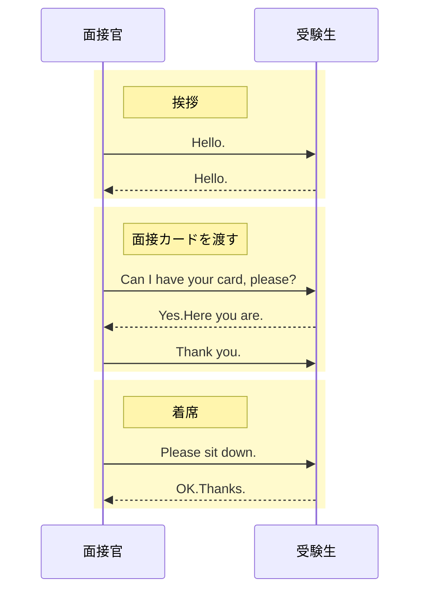
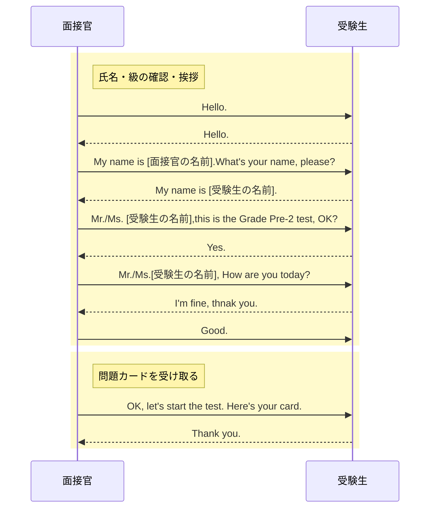
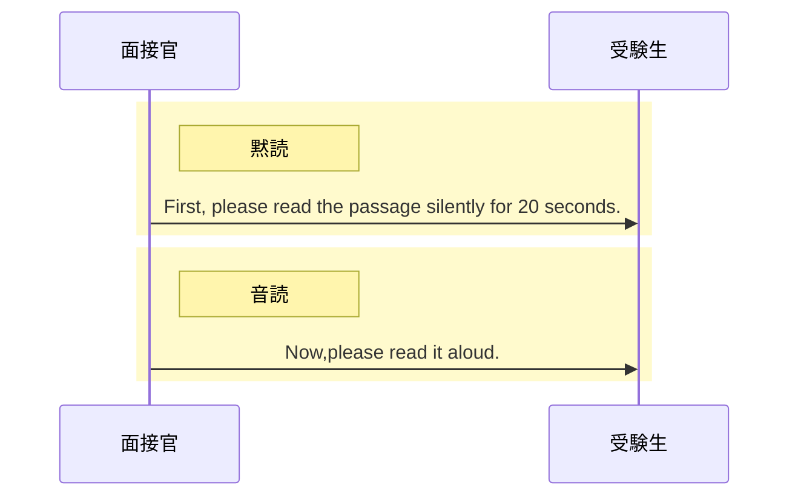
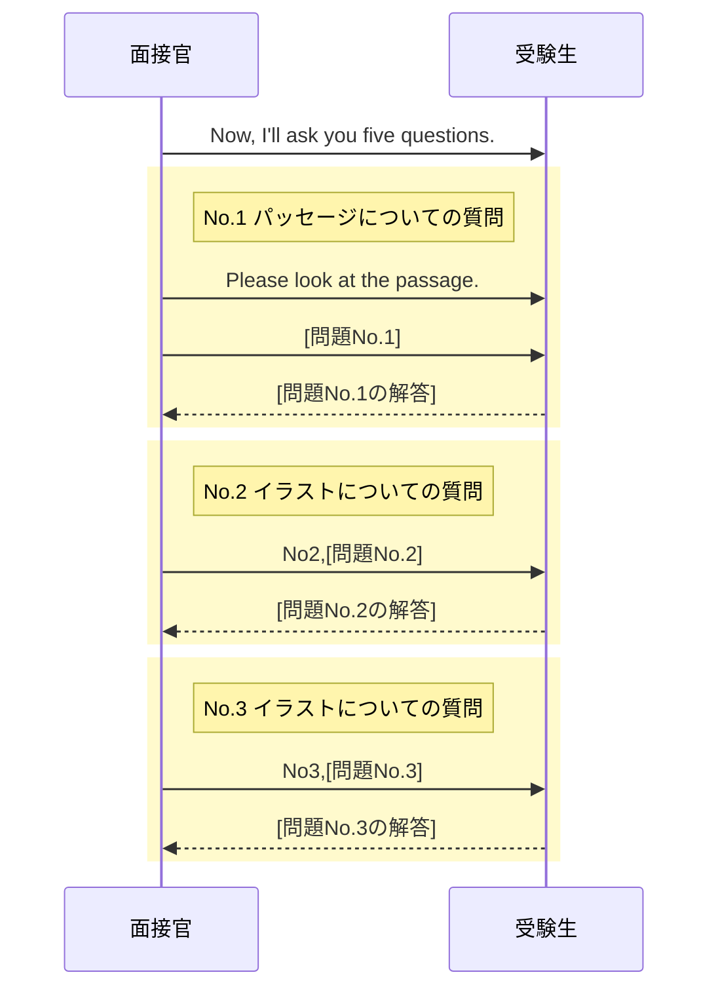
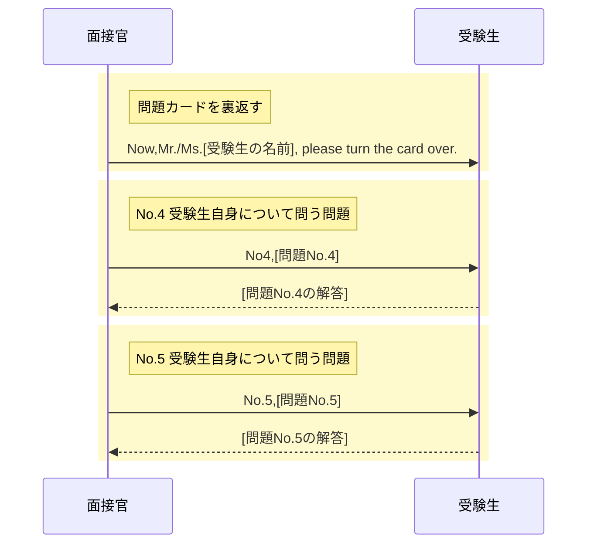
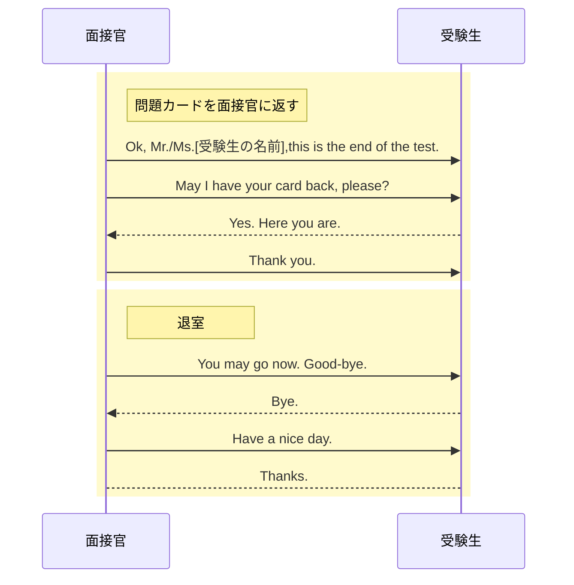

# 英検準2級二次試験スクリプトと会話表現

## 入室~着席

## 名前・級の確認~問題カードの受取

## 音読～黙読

## 質問(No.1~No.3)

## 質問(No.4~No.5)

## 面接カードを返す~退室

## 使える英語表現

### 聞き取れなかった時に聞き返す表現

- I beg your pardon?
- Pardon me?
- Pardon?
- Excuse me?
- Sorry, could you repeat the question?
- Could you repeat again?
- Would you say that again, please?
- What was that again?

Pardon?は **I beg your padon?** の略でめっちゃくちゃ丁寧な表現。  

### 考える時間がほしい時

- Well...
- Let's see.
- Let me see.
